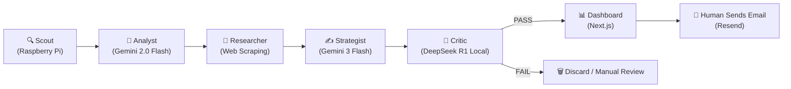

# Signal Scout 2.0 — Deep System Analysis & Critique

**Document reviewed:** [Plan _v3.md](file:///c:/Users/Kundan/Downloads/Autonomous%20Distributed%20Research%20%26%20Lead%20Generation%20Agent/plan/Plan%20_v3.md)  
**Date:** 2026-04-27  

---

## How The System Works (Plain English)

Signal Scout 2.0 is a **B2B lead generation agent** that reads public job postings to find companies with operational pain points that an automation agency (AK 0121) could solve.



### The Flow in 7 Steps:
1. **Scout (Pi, 24/7):** Scrapes Greenhouse job boards, RSS feeds, SearXNG search results, and HN "Who's Hiring" threads every 4 hours. Caches to SQLite.
2. **Pre-Filter:** A regex-based pain keyword scorer kills ~80% of jobs before any LLM is invoked (score < 4 = rejected).
3. **Analyst (Gemini 2.0 Flash, LOQ):** Takes surviving jobs and generates a "Pain Hypothesis" — a 2-sentence inference about what operational bottleneck the hiring implies. Outputs an automatibility score (0–10).
4. **Researcher (Web scraping, LOQ):** Scrapes `/about` and `/team` pages to find decision-makers. Uses Hunter.io (25/mo free) and Apollo (50/mo free) for email patterns. Falls back to pattern guessing.
5. **Strategist (Gemini 3 Flash, LOQ):** Writes a personalized 100–120 word cold email pitch using one of 3 tone profiles, informed by the pain hypothesis and any agent memories.
6. **Critic (DeepSeek R1 7B local, LOQ):** Scores the pitch across 7 dimensions (specificity, consultative, tone, brevity, value, credibility, humanity). PASS ≥ 7.0 average. No auto-retry — failure goes to human.
7. **Dashboard (Next.js):** Human reviews, edits, and sends approved pitches via Resend. No automated blasting.

### The Memory System:
- **Layer 1 (Episodic):** Supabase Postgres — every lead/pitch/outcome as structured data.
- **Layer 2 (Semantic):** pgvector — embeddings of JDs and pitches for similarity search.
- **Layer 3 (Agent):** Mem0 + Chroma — unstructured strategic learnings ("Pune founders prefer X tone").

### The Hardware Split:
- **Raspberry Pi (24/7):** Ingestion, SearXNG hosting, SQLite cache, Supabase sync.
- **Lenovo LOQ (daily batch at 6 AM):** All LLM inference, memory, and heavy processing.

---

## Overall Rating

### **7.2 / 10 — "Ambitious, well-structured, but will hit painful walls during execution"**

| Category | Score | Comment |
|----------|-------|---------|
| **Architecture Design** | 8.5/10 | DAG approach with clear node separation is excellent |
| **Feasibility** | 5.5/10 | Free-tier dependencies create fragile bottlenecks |
| **Completeness** | 8/10 | Impressively thorough — prompts, schemas, docker, cron |
| **Scalability** | 4/10 | Hard ceiling at ~10 emails/day, 25 enrichments/month |
| **Data Quality** | 5/10 | Researcher node is the weakest link by far |
| **Compliance & Ethics** | 9/10 | Thoughtful, explicit rules — rare for this kind of project |
| **Execution Realism** | 5/10 | 5-week timeline is aggressive for a 2-person team |
| **Documentation Quality** | 9.5/10 | One of the best system design docs I've seen at this stage |

---

## What's GOOD (Strengths)

### 1. 🎯 The Core Thesis is Brilliant
> "A job posting is a confession of operational friction."

This is genuinely insightful. Most lead-gen tools blast contact lists. This system has a **signal-first philosophy** — every lead originates from an observable pain point. This gives your cold emails legitimacy because you're responding to a *public admission of need*.

### 2. 🏗️ Clean Architectural Separation
The DAG with 5 clear nodes (Scout → Analyst → Researcher → Strategist → Critic) is textbook good design:
- Each node has a single responsibility
- Each has its own model choice rationale
- State flows cleanly through LangGraph's `ScoutState`
- Failure at any node doesn't cascade unpredictably

### 3. 🔒 The Critic Node is the Best Idea in the Whole Doc
Most AI systems generate → ship. You have a **separate reasoning model** (DeepSeek R1, chosen specifically for its chain-of-thought capability) acting as quality control. The 7-dimension scoring rubric is specific and measurable. The "no auto-retry" rule prevents infinite token burn. This alone puts you ahead of 90% of similar projects.

### 4. 🧠 Three-Layer Memory is Architecturally Sound
The episodic → semantic → agent memory stack is well-reasoned:
- Layer 1 prevents duplicate pitching (critical for cold email reputation)
- Layer 2 enables "find similar leads" without keyword matching
- Layer 3 allows strategic learning over time
- The phased rollout (Week 1 → 2 → 3) shows maturity

### 5. 📋 Compliance Section is Exemplary
The explicit ❌/✅ rules (no LinkedIn scraping, no OSINT, no automated blasting, unsubscribe in every email, domain warmup schedule) show you've thought about **deliverability and legality**. The warmup schedule (2–3 → 3–5 → 5–7 → 10/day over 4 weeks) is industry-standard.

### 6. 🔧 Hardware Split is Pragmatic
Pi for always-on ingestion, LOQ for daily batch reasoning — this is a smart resource allocation. The comparison table (Section 4.3) correctly identifies what each machine can and can't handle.

### 7. 📊 The Pre-Filter is a Smart Cost Gate
Regex-based pain scoring before any LLM call is critical when you're on free tiers. The keyword dictionary with weighted scoring is simple but effective. This will save 80% of your API quota.

---

## What's BAD (Weaknesses)

### 1. 🚨 The Researcher Node is a House of Cards

This is the **single biggest weakness** in the entire system. Let me break it down:

| Method | Realistic Hit Rate | Why |
|--------|-------------------|-----|
| Scrape `/about`, `/team` pages | ~15-20% | Most modern sites use JS-rendered pages (React/Next.js). `requests + BeautifulSoup` will get empty HTML. Many companies don't have public team pages at all. |
| Hunter.io free tier | 25 searches/month total | That's less than 1/day. You'll exhaust this by Day 2 of testing. |
| Apollo.io free tier | 50 credits/month | ~2/day. Also exhausted quickly. |
| Pattern guessing | ~10-15% accuracy | Most companies don't use `first@domain.com`. Many use Google Workspace with custom patterns. You'll get bounce rates >50%. |

**The result:** For most leads, you'll have NO verified email and a GUESSED decision-maker. You're sending pitches into the void.

### 2. 🧱 The Free-Tier Stack is a Jenga Tower

> [!CAUTION]
> **Every free service in this stack can change or revoke their free tier at any time.** Google has done this before (killed free tier for Google Maps API, Firebase auth free limits, etc.).

Specific risks:
- **Gemini free tier (1,500 req/day):** This quota has already changed multiple times. Google AI Studio's free tier is intended for "experimentation," not production workloads. They can throttle or kill it without notice.
- **Supabase free (500MB, 500K req/day):** Supabase pauses inactive projects after 1 week. If your Pi sync fails for a few days, your database goes to sleep.
- **Resend (3,000/mo):** At 10/day × 30 days = 300 emails. This is fine. But Resend's free tier has strict deliverability policies — cold email campaigns often get flagged.

### 3. 📉 The "Automatibility Score" is Circular Reasoning

You're asking an LLM to score "how automatable is this process" on a 0–10 scale. But:
- The LLM has no domain expertise in AK 0121's actual capabilities.
- A score of "9" for one LLM call might be "6" for the next with identical input.
- There's no calibration. What does a "7" mean vs a "6"?

The pre-filter's regex scoring is actually MORE reliable than the LLM's numeric score because it's deterministic.

### 4. 🕐 The Daily Batch Model Creates Stale Leads

```
Pi scouts every 4 hours → LOQ processes at 6 AM next day → Human reviews → Email sent manually
```

**Best case latency: 12–30 hours from discovery to email.** For a job posting, this might be OK. But if a company posts on Monday morning and you email Wednesday, someone else has already reached out. Hot signals go cold fast.

### 5. 📝 Single Monolithic `leads` Table is a Smell

The `leads` table has **35+ columns** spanning source tracking, company info, job details, pain analysis, enrichment, pitch content, critic scores, state machine, and metadata. This is a classic "God table" anti-pattern.

Problems:
- Every node updates the same row → lock contention with concurrent access
- Schema migrations become painful (changing pitch format breaks analytics queries)
- The `status` state machine (7+ states) should be a separate state transition table with timestamps

### 6. 🔄 No Error Recovery in the Pipeline

The daily batch script (Section 13.4) is a linear bash script:
```bash
python nodes/analyst.py
python nodes/researcher.py
python nodes/strategist.py
python nodes/critic.py
```

If `researcher.py` crashes at lead #47 of 100, what happens?
- Do leads 1–46 keep their state? (Maybe)
- Does strategist.py skip them or re-process? (Unknown)
- Is there an idempotency guarantee? (No mention)

LangGraph can handle this, but the plan doesn't address checkpointing or partial failure recovery.

---

## Mistakes I Spotted

### Mistake 1: RLS Policy Uses `auth.uid()::text = assigned_to`
```sql
CREATE POLICY "Users can view own leads" ON leads
    FOR SELECT USING (auth.uid()::text = assigned_to);
```
The `assigned_to` field defaults to `'ak0121'`. But `auth.uid()` returns a UUID, not a username string. These will **never match**. Your RLS will block all reads from authenticated users.

**Fix:** Either use UUIDs for `assigned_to` (referencing `auth.users.id`) or use a separate user lookup.

### Mistake 2: Greenhouse API Assumption
```python
url = f"https://boards.greenhouse.io/{company}.json"
```
Not all Greenhouse customers expose a `.json` endpoint. Many have custom career pages that don't serve JSON at all. Some companies on Greenhouse use subdomains (`{company}.greenhouse.io`), others use embedded widgets. Your hit rate on the seed list (Razorpay, Groww, etc.) — **many of these companies don't use Greenhouse at all**. Razorpay uses their own careers page. Zerodha has minimal public hiring.

### Mistake 3: SearXNG Reliability is Overstated
SearXNG is a meta-search engine that queries Google, Bing, DuckDuckGo, etc. **These upstream engines actively block automated queries.** A self-hosted SearXNG instance:
- Gets rate-limited or CAPTCHAed by Google within hours of heavy use
- Returns degraded results over time as your IP gets flagged
- Requires constant engine rotation and configuration tweaking

The plan treats SearXNG as "unlimited" (Section 14.1). In practice, you'll get 20–50 usable queries per day before results degrade.

### Mistake 4: `docker-compose.yml` Uses Deprecated `version` Key
```yaml
version: '3.8'  # ← Deprecated in modern Docker Compose
```
Modern Docker Compose (v2+) ignores the `version` key. Not a functional bug, but indicates the author is referencing older Docker patterns.

### Mistake 5: Pain Keyword List Has Overlapping Weights
```python
"tedious": 2,  # In PAIN_KEYWORDS
"tedious": ... # Also in FRUSTRATION_SIGNALS (+1)
```
A job description mentioning "tedious" once gets 3 points (2 from keywords + 1 from frustration). Similarly for "time-consuming" and "error-prone". This isn't necessarily wrong, but it means these specific words are over-weighted vs. more diagnostic terms like "reconciliation."

### Mistake 6: `vercel` is Listed Twice in `GLOBAL_TARGETS`
```python
GLOBAL_TARGETS = [
    ..., "vercel", ..., "vercel"  # duplicate
]
```
Minor, but sloppy — `set()` would fix this.

### Mistake 7: Ollama Install Script Assumes Linux
```bash
curl -fsSL https://ollama.com/install.sh | sh
```
The LOQ runs Windows (user's OS is Windows). Ollama on Windows uses a different installer (`.exe`). The cron-based batch script (`daily_batch.sh`) is also Linux-only. You'll need Task Scheduler or a PowerShell script on Windows.

### Mistake 8: No Deduplication at the Scout Level
Multiple scouts (Greenhouse, RSS, SearXNG, HN) can discover the **same job posting**. There's no dedup logic before inserting into SQLite. The `job_url UNIQUE` constraint in Supabase will catch it, but only after the lead has been pushed — wasting sync bandwidth and potentially causing insertion errors.

---

## Issues You'll Face (Free-Tier Reality Check)

### Issue 1: Email Deliverability Will Be Your #1 Problem
Even with perfect pitches, cold email from a new domain faces:
- **SPF/DKIM/DMARC setup required** (not mentioned anywhere in the plan)
- **Gmail and Outlook aggressively filter new domains** — your first 50 emails will likely land in spam
- **Pattern-guessed emails bounce** → high bounce rate → domain reputation tanks → ALL future emails go to spam
- **Resend's free tier explicitly warns against cold outreach** — they may suspend your account

> [!WARNING]
> A bounce rate above 5% will destroy your sending domain's reputation. With pattern-guessed emails, expect 30-50% bounces initially. **This is a fatal flaw.**

### Issue 2: Gemini Free Tier Quota Exhaustion
1,500 requests/day sounds like a lot, but:
- The Analyst consumes 1 call per qualifying job (plan says 1,000/day allocation)
- The Strategist consumes 1 call per lead (300/day)
- That leaves 200 for retries, testing, debugging

If you have a bug that causes a loop, or you want to test prompt changes, you'll burn through quota in minutes. There's **no local fallback for the Analyst** — if Gemini is down or throttled at 6 AM, your entire daily batch stalls.

### Issue 3: The Pi Will Struggle with Docker
Running SearXNG (which runs Tor, Redis, and a Python web server) inside Docker on a Raspberry Pi 4 with 4GB RAM is tight. SearXNG alone wants 500MB+. With the Python scout process, SQLite writes, and cron jobs, you'll be at 70-80% RAM usage. Expect:
- Swap thrashing on SD card (kills SD card lifespan)
- SearXNG timeouts during heavy query batches
- Random OOM kills

**Recommendation:** Use a USB SSD (not SD card) and 8GB Pi minimum.

### Issue 4: Team Page Scraping Won't Work for 80% of Companies
Modern company websites are:
- **React/Next.js SPAs** → `requests.get()` returns an empty `<div id="root"></div>`
- **Behind Cloudflare/Vercel protection** → returns 403 or CAPTCHA
- **No `/team` page at all** → most startups < 50 people don't maintain public team pages

You need **Playwright or Puppeteer** for JS-rendered pages, which is too heavy for the Pi and adds significant complexity on LOQ.

### Issue 5: LangGraph State Management Across Two Machines
The plan shows LangGraph running on LOQ, but the state originates from Pi (via SQLite → Supabase). This means:
- LangGraph's DAG isn't truly end-to-end — it only covers the LOQ batch portion
- The Pi → Supabase → LOQ handoff is a manual sync, not a graph edge
- If the sync fails or is delayed, the LOQ batch processes stale or empty data

### Issue 6: Mem0 + Chroma Adds Complexity Before Value
The plan wisely says "Mem0 after Week 3, after 20+ interactions." But:
- Chroma's self-hosted version requires managing persistence, migrations, and backup
- With 10 emails/day and a 5% response rate, you'll have ~3.5 responses/week
- It'll take **2+ months** to accumulate enough data for Mem0 to provide meaningful patterns
- Meanwhile, Chroma is consuming RAM on LOQ and adding a dependency that can crash

### Issue 7: No Monitoring or Alerting
If the Pi's SearXNG container dies at 2 AM, you won't know until you manually check. The "health check" cron (Section 13.3) only runs at 5 AM and only checks if Docker is up — not if SearXNG is returning results, not if the scout is finding jobs, not if Supabase sync is succeeding.

---

## Summary Verdict

```
┌─────────────────────────────────────────────────────────────────┐
│                    SIGNAL SCOUT 2.0 VERDICT                      │
├─────────────────────────────────────────────────────────────────┤
│                                                                  │
│  Architecture Design ........... ████████░░  8.5/10  Excellent  │
│  Documentation Quality ......... █████████░  9.5/10  Best-in-class│
│  Core Thesis ................... █████████░  9.0/10  Brilliant   │
│  Compliance & Ethics ........... █████████░  9.0/10  Exemplary   │
│  Feasibility (Free Stack) ...... █████░░░░░  5.5/10  Fragile     │
│  Data Quality (Enrichment) ..... █████░░░░░  5.0/10  Weak link   │
│  Scalability ................... ████░░░░░░  4.0/10  Hard ceiling │
│  Execution Timeline ............ █████░░░░░  5.0/10  Aggressive  │
│                                                                  │
│  OVERALL ....................... ███████░░░  7.2/10              │
│                                                                  │
│  Bottom Line: A well-designed system with a brilliant thesis,    │
│  held back by a fragile enrichment layer and free-tier risks.    │
│  Ship a narrow v1 (Greenhouse-only, manual enrichment) in       │
│  Week 1, then iterate.                                           │
└─────────────────────────────────────────────────────────────────┘
```

---

## Top 5 Recommendations

| # | Recommendation | Impact |
|---|---------------|--------|
| 1 | **Skip pattern-guessed emails entirely.** Only send to emails verified by Hunter or scraped from public pages. Accept lower volume for dramatically better deliverability. | 🔴 Critical |
| 2 | **Set up SPF, DKIM, DMARC on Day 1.** Before writing a single line of agent code. Test with Mail-Tester.com. | 🔴 Critical |
| 3 | **Add a Playwright-based scraper** for team pages instead of raw `requests`. Run it on LOQ only. | 🟡 High |
| 4 | **Split the God table.** At minimum: `jobs`, `companies`, `contacts`, `pitches`, `pipeline_state`. Normalize. | 🟡 High |
| 5 | **Build Week 1 as CLI-only** — no dashboard, no memory, no Mem0. Scout → Analyst → CSV output. Prove the signal quality first. | 🟢 Strategic |

---

> [!IMPORTANT]
> **The plan is genuinely impressive as a design document.** The thinking is sharp, the architecture is clean, and the ethical guardrails are mature. The problems are almost entirely in the *execution layer* — enrichment reliability, free-tier fragility, and email deliverability. Fix the enrichment and email layers, and this system can actually work.
